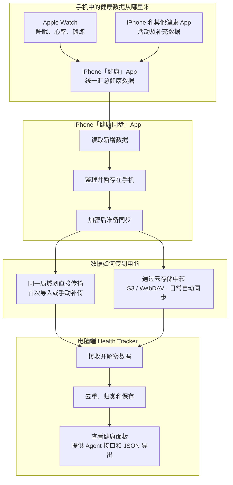

# Health Tracker

Health Tracker 是一个开源、自托管的个人健康数据系统。iPhone 只读 Apple Health/HealthKit，把增量数据在手机端加密后同步到你自己的 Receiver；Receiver 负责去重、规整、按日汇总、健康面板和本机 Agent API。

当前公开测试版本：[`v0.1.0-beta.1`](CHANGELOG.md)。`0.x` 阶段可能调整接口和规整规则，升级前请阅读变更记录并保留 Receiver 加密备份。

> 本项目不是医疗器械，不提供诊断或治疗建议。健康结论应结合长期趋势、个人情况和专业医疗意见。

## 系统组成



- 健康数据来自 iPhone“健康”App；“健康同步”App 只读取，不会修改健康数据。
- 首次导入可以在同一局域网内直接传输，之后的新增数据通过加密云存储自动中转。
- 网络中断时，尚未传完的数据会留在手机中，恢复后继续同步。
- 电脑端负责解密、去重、归类和保存，并提供健康面板、Agent 接口和 JSON 导出。
- 电脑端可运行在 macOS、Linux 或 NAS；Mac mini 只是推荐的常开设备。

完整设计见 [系统架构](docs/system-architecture-v2.md)、[iOS 增量同步策略](docs/ios-sync-strategy.md) 和 [加密同步协议](docs/encrypted-sync-protocol-v1.md)。

## 当前能力

- 睡眠：主睡眠、午睡、阶段、效率、连续率、入睡/起床规律和睡眠期生命体征。
- 活动：步数、距离、活动能量、锻炼分钟、站立和楼层。
- 心肺与恢复：心率、静息心率、HRV、血氧、呼吸、腕温、VO₂ Max、心率恢复和个人基线。
- 锻炼：类型、时间、时长、距离、配速、爬升、路线、心率区间、跑步功率、步频等专项指标。
- 数据质量：来源覆盖、设备能力、新鲜度、序列缺口、待规整任务和同步状态。
- 第三方睡眠来源可作为补充；有 Apple Watch 分期时优先使用分期样本，未分期来源只填补不重叠片段。
- 快捷指令：App 公开“立即增量同步”触发动作，可由到达家、到达公司、Wi-Fi、充电器等个人自动化调用；动作只持久化同步请求并立即返回，读取、加密和上传由 App 在 iOS 允许时执行。
- Agent API 给本机程序提供字段目录、单日上下文和时间序列，不暴露默认不需要的原始元数据与精确路线。

## 快速开始

### 1. 安装 Receiver（macOS）

要求 Python 3.11+。克隆仓库后执行：

```bash
git clone https://github.com/leafhao/health-tracker.git
cd health-tracker
./scripts/configure_receiver_macos.zsh install --mode agent
```

适合常开 Mac mini 的最终模式是 LaunchDaemon：

```bash
./scripts/configure_receiver_macos.zsh install --mode daemon --apply-power
```

`--apply-power` 会修改接电睡眠、网络唤醒和断电恢复设置，只有明确需要时才添加。安装完成后检查：

```bash
./scripts/configure_receiver_macos.zsh check
curl http://127.0.0.1:8787/api/v1/healthbeat/ready
```

浏览器在 Receiver 本机打开 `http://127.0.0.1:8787/dashboard`。完整运维说明见 [macOS 常驻服务](docs/macos-service-hardening.md)，已有 Receiver 迁移见 [Receiver 迁移](docs/receiver-migration.md)。

Linux 使用：

```bash
./scripts/configure_receiver_linux.sh install --dry-run
sudo ./scripts/configure_receiver_linux.sh install
```

详情见 [Linux 常驻服务](docs/linux-service-hardening.md)。

### 2. 安装 iPhone App

要求 iOS 17.6+、Xcode 16+ 和真机。模拟器没有个人 HealthKit 数据。

1. 打开 `ios/HealthBeat/Health Beat.xcodeproj`。
2. 选择 **Health Beat → Signing & Capabilities**，选择自己的 Team。
3. 把 Bundle Identifier 改为自己唯一的值；确认 HealthKit、HealthKit Background Delivery 和 Background Fetch 权限存在。
4. 连接并解锁 iPhone，在 Xcode 中 Build & Run。
5. 手机进入“设置 → 端到端加密”，自动发现同一局域网的 Receiver 并请求配对。
6. 在 Receiver 本机面板批准请求，再回到手机完成首次同步范围选择。

App 只申请读取权限，不会写入或修改健康数据。第一次建议先验证最近 30 天或一年，不要直接回溯全部历史。首次直传期间会显示批次进度，锁屏后的文件上传由后台 `URLSession` 接管；不要从多任务界面强制划掉 App。

iOS 的后台执行时间由系统决定。App 会在冷启动入口注册 HealthKit Observer，并使用系统后台 `URLSession` 上传 S3 密文包；正确预期仍是“自动补传并最终一致”，不是固定每隔多少分钟执行一次。请在“设置 → 通用 → 后台 App 刷新”中允许“健康同步”，并关闭低电量模式进行首次后台验证。各触发入口与失败恢复规则见 [iOS 增量同步策略](docs/ios-sync-strategy.md)。

### 3. 配置密文中继

在手机“云存储”页选择 S3 或 WebDAV，填写自己账户的 Endpoint、Bucket/目录和凭据。S3 Endpoint 可填写域名或完整 `https://` 地址。

手机先对每个批次做端到端加密和签名，再把多个密文批次打成约 8 MiB 的传输包。云端保留天数只作用于已收到可信 Receiver 回执的密文；未确认数据不会仅因到期自动删除。

云存储凭据、手机私钥和 Receiver 配对信息分别保存在设备 Keychain/Receiver 私有数据目录中，不进入仓库。

### 4. 配置快捷指令停靠点保底（推荐）

完成首次同步并配置云存储后，打开 iPhone“快捷指令”：

1. 进入“自动化”，新建“到达”个人自动化，分别设置家庭和公司位置。
2. 添加操作，搜索“健康同步”并选择“立即增量同步”。
3. 将自动化设置为“立即运行”，关闭运行前询问。
4. 可选：再为家庭或公司 Wi-Fi 建立相同自动化，作为稍晚一次的冗余触发。

该动作只写入一个带时间戳的持久化同步请求、提交系统后台刷新并立即返回，不在快捷指令执行窗口内等待 HealthKit 或网络。App 会利用当前剩余执行时间尽力开始处理；若被系统挂起，请求仍会由后续后台刷新、HealthKit 变化唤醒或进入前台时消费。它不打开 App、不等待 Receiver 入库、不扫描历史，也不会主动弹出额外对话框。多次触发会合并，增量 anchor、稳定批次 ID 和 Receiver 幂等入库共同保证不会重复入库；具体后台运行时间仍由 iOS 决定。

## 日常使用

- iPhone：让 App 保持后台刷新权限，不需要每天手动打开；可把 App 的“立即增量同步”快捷指令动作绑定到家、公司或 Wi-Fi 作为停靠点保底，偶尔进入首页可触发补漏并查看待上传数量。
- Receiver：正式安装后由 Web API、规整/面板物化 Worker、云中继 Worker 三个独立进程组成；维护和备份另由定时任务执行。
- 面板：在 Receiver 本机访问 `/dashboard`；不要把 8787 端口映射到公网。
- Agent：同机程序访问 `http://127.0.0.1:8787/api/v1/agent/catalog` 和相关只读接口，见 [Agent API](docs/agent-api.md)。

## Mac mini + Xcode 免费续签（推荐）

本项目只推荐 Xcode Personal Team 覆盖安装，不依赖第三方重签工具。长期在线的 Mac mini
作为续签主机：Xcode Automatic Signing 负责签名，launchd 每 30 分钟检查一次；描述文件
剩余不足 72 小时或 iOS 源码发生变化时重新构建。手机与 Mac mini 同一局域网时无线覆盖
安装，暂时离线则保留已签名产物并在后续检查中重试。覆盖安装不会主动卸载 App，也不会
清空 App 沙盒、Keychain、HealthKit 授权或快捷指令绑定。

一次性准备包括：在 Mac mini 安装并登录 Xcode、用 USB 与 iPhone 配对、开启 Finder 的
“连接 Wi-Fi 时显示此 iPhone”、保持开发者模式开启，然后安装仓库提供的续签任务：

```zsh
IOS_DEVICE_ID='你的 iPhone UDID' \
DEVELOPMENT_TEAM='你的 Team ID' \
BUNDLE_IDENTIFIER='你的唯一 Bundle ID' \
./scripts/configure_ios_autorenew_macos.zsh install
```

另一台开发 Mac 可以安全导入 Mac mini 当前 Apple Development 证书及私钥，从而使用同一
签名身份构建和有线安装。证书只能通过带强密码的临时 `.p12` 点对点转移，导入后应立即删除
`.p12` 和密码；不要通过 Git、GitHub、网盘或聊天工具保存证书。GitHub 只用于同步源码。
正常的 7 天描述文件续期不会更换证书，只有证书被撤销或 Xcode 创建了新证书时才需要重新
同步证书。

无线安装依赖 Bonjour/CoreDevice 和真实的同一局域网；Tailscale 可以远程管理 Mac mini、
同步代码和查看续签状态，但不能替代 iPhone 与 Mac mini 的本地无线安装通道。完整安装、
多 Mac 证书同步、安全边界和故障恢复见
[Mac mini + Xcode 自动续签](docs/xcode-personal-team-autorenew.md)。

## 数据与安全边界

- 明文只存在于 iPhone HealthKit 和 Receiver 本地数据库。
- 配对使用 Receiver X25519/HPKE 公钥与手机 Ed25519 身份；Receiver 私钥从不通过发现接口公开。
- S3/WebDAV 是可替换的密文传输缓冲，不是唯一备份。
- Receiver 迁移必须同时迁移 SQLite 和 `keys/`，否则手机已有密文无法解密。
- Dashboard 仅允许 Receiver 本机或经过受信 Tailscale 身份代理访问；Agent API 强制 localhost。
- 不要提交 `.env`、数据库、Receiver 私钥、S3 凭据、导出 JSON、备份包或 IPA。

详见 [安全说明](SECURITY.md)。

## 仓库结构

```text
health-tracker/
├── ios/HealthBeat/       # iPhone HealthKit Collector
├── receiver/             # FastAPI、SQLite、规整、面板和 Agent API
├── schemas/              # 密文信封与事件批次 JSON Schema
├── scripts/              # macOS/Linux 安装、维护、备份和构建脚本
├── docs/                 # 架构、协议、部署、迁移和验证文档
└── legacy/shortcuts/     # 早期快捷指令原型，仅供回溯
```

## 开发与验证

```bash
python3 -m venv .venv
.venv/bin/pip install -r receiver/requirements.txt
.venv/bin/python -m unittest discover -s receiver/tests -v
python3 scripts/check_release_version.py
```

iOS 编译检查：

```bash
xcodebuild -project 'ios/HealthBeat/Health Beat.xcodeproj' \
  -scheme 'Health Beat' -sdk iphonesimulator \
  -destination 'generic/platform=iOS Simulator' \
CODE_SIGNING_ALLOWED=NO build
```

## 版本与发布

- 根目录 [`VERSION`](VERSION) 是产品发布版本基线，采用 Semantic Versioning。
- iOS Bundle 使用 Apple 要求的纯数字短版本，同时在 App 内展示完整产品版本（例如 `0.1.0-beta.1`）。
- 加密同步协议 `schema_version` 和 SQLite migration 版本独立演进，不随产品补丁版本自动改变。
- 日常修复继续以小提交进入 `main`；只有通过 Receiver 测试和 iOS 无签名编译的提交才打 `v*` 标签。
- 推送版本标签后，GitHub Actions 会验证标签与代码版本一致，并创建 GitHub Release。具体变化见 [`CHANGELOG.md`](CHANGELOG.md)。

## 已知限制

- iOS 不保证后台任务的固定执行时间；用户强制划掉 App 后，后台唤醒通常停止到下次打开。
- Apple Watch 的私有训练心率区间无法直接读取；面板使用个人近期最高心率和静息心率计算可解释的五级心率储备区间。
- 睡眠、腕温、血氧等数据是否存在取决于设备、权限、佩戴情况和数据来源。
- 本项目仍处于个人试用与规则校准阶段；发布版本不保证医疗级正确性。

## License 与致谢

项目采用 [MIT License](LICENSE)。iOS 工程最初基于 Klemens Arro 的 MIT-licensed Health Beat 项目演进，当前同步、加密、Receiver 和面板架构已重构；原始版权声明继续保留。
