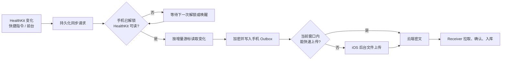

# iOS 健康数据后台同步：调研结论与改造建议

> 调研日期：2026-09-03 
> 目标：让 Health Tracker 尽可能少干预地把 HealthKit 增量同步到 Receiver，同时明确 iOS 无法保证的边界。

## 先说结论

基于成熟案例改造是更好的做法，但不建议把某个开源项目整体搬进来。

我们的方向其实没有走错：当前已经具备 HealthKit 增量游标、手机本地加密队列、稳定批次 ID、后台文件上传、Receiver 幂等入库，以及快捷指令/前台补传。真正需要重构的是**同步协调层**：所有触发先可靠记账，再分阶段完成读取、落盘、上传和确认；某一步暂时不能执行时，留给下一次机会继续。

不存在能让普通健康 App 在 iOS 上永久常驻、保证实时读取 HealthKit 的正规方案。Apple 明确规定后台任务由系统调度；手机锁定时 HealthKit 数据库受保护，App 可能无法读取；`.immediate` 也只是通知频率上限，不是实时承诺。[Apple：HealthKit Observer](https://developer.apple.com/documentation/healthkit/executing-observer-queries)、[Apple：HealthKit 隐私保护](https://developer.apple.com/documentation/healthkit/protecting-user-privacy)、[Apple：后台任务策略](https://developer.apple.com/documentation/backgroundtasks/choosing-background-strategies-for-your-app)

## iOS 到底允许什么

一次同步实际上有五步：

- **HealthKit Observer**：能在数据变化时唤醒 App，但通知只表示“有变化”，需要再用 anchored query 读取增量。Observer 必须尽快正确调用 completion；Apple 说明连续三次不响应后可能停止后台投递。[Apple：Observer completion](https://developer.apple.com/documentation/healthkit/hkobserverquerycompletionhandler)
- **锁屏**：设备锁定时 HealthKit Store 被加密，查询可能返回 database inaccessible。到家、充电、后台刷新或静默推送都绕不过这一点，只能记下请求，解锁后继续。[Apple：database inaccessible](https://developer.apple.com/documentation/healthkit/hkerror/errordatabaseinaccessible)
- **BGAppRefresh**：是系统择机给出的短执行机会，通常最多约 30 秒，不是定时器。因此“5 分钟后重试”只能理解为“最早 5 分钟，实际由 iOS 决定”。[Apple：后台策略](https://developer.apple.com/documentation/backgroundtasks/choosing-background-strategies-for-your-app)
- **后台 URLSession**：很适合上传已经生成的密文文件，App 挂起后系统仍可继续；但它不能替 App 醒来读取 HealthKit。从后台发起时，即使代码设置 `isDiscretionary = false`，系统仍可延后执行。Apple 也建议用少量较大的任务，不要制造几千个小上传。[Apple：后台传输](https://developer.apple.com/documentation/foundation/downloading-files-in-the-background)、[Apple：isDiscretionary](https://developer.apple.com/documentation/foundation/urlsessionconfiguration/isdiscretionary)
- **快捷指令**：到达、Wi-Fi、充电器、Apple Watch 训练等自动化可以设成无需确认，但它们只是额外的执行机会，仍受锁屏和运行时长限制。[Apple：可自动运行的个人自动化](https://support.apple.com/en-au/guide/shortcuts/apd602971e63/ios)

## 值得借鉴的案例

| 案例 | 做得好的地方 | 明确的局限 | 对我们的启发 |
|---|---|---|---|
| Health Auto Export | 指标筛选、自动化日志、Widget/快捷指令/提醒兜底；历史导出与日常自动化分开 | 官方承认锁屏不能读取、iOS 不保证时间、复杂查询容易超过后台窗口 | 不承诺“实时”；展示数据新鲜度和失败阶段；保留一键打开并同步 |
| Stanford SpeziHealthKit | 一个 Observer 观察多种类型；只处理实际变化类型；连续采集与 Bulk Export 分层；失败批次可恢复 | 它是采集框架，不含我们的加密中继和 Receiver | 作为 HealthKit 采集层的主要参考 |
| Microsoft health-data-sync | Observer 串行化；anchored query 分页；成功后推进 anchor | 最后实质代码较旧，且把网络放在 Observer 临界路径中 | 借鉴串行化和游标原则，不照搬网络耦合 |
| healthykit | SQLite 保存 anchor、待传批次、重试次数和日志；多入口补偿 | 项目较新，实战成熟度未知 | 佐证 durable outbox 和完整日志的必要性 |
| Garmin / Strava / Oura | 都提供自动同步，同时保留前台刷新、通知或手动导入 | Garmin 明确要求前台打开；Oura 也建议每日打开集成 App | 连大型商业产品都不把 iOS 后台当绝对可靠通道 |

Health Auto Export 的官方文档尤其有参考价值：它明确建议减少导出指标、缩短范围、避免分钟级全量处理，并使用 Widget、快捷指令和提醒补偿；这说明成熟产品的关键不是“藏着一个常驻技巧”，而是把短增量、失败恢复和用户兜底做好。[Health Auto Export 自动化说明](https://help.healthyapps.dev/en/health-auto-export/automations/)

其他成熟产品也保留了前台或人工补偿：Garmin 明确说明 App 未在前台时，向 Apple Health 的传输会暂停；Strava 在自动导入之外保留通知和手动 Import；Oura 则建议每天至少打开一次相关 App，并指出后台刷新和低电量模式会影响同步。[Garmin 与 Apple Health](https://support.garmin.com/en-AU/?faq=lK5FPB9iPF5PXFkIpFlFPA)、[Strava 与 Apple Health](https://support.strava.com/en-us/articles/15402024-apple-health-and-strava)、[Oura 与 Apple Health](https://support.ouraring.com/hc/en-us/articles/360025438734-Apple-Health-Integration)

开源实现中，[Stanford SpeziHealthKit](https://github.com/StanfordSpezi/SpeziHealthKit) 是最现代、最适合参考的采集层；[Microsoft health-data-sync](https://github.com/microsoft/health-data-sync) 已归档，只适合看设计思想；[healthykit](https://github.com/megabyte0x/healthykit) 与我们的自托管目标接近，但较新，不能直接视为成熟产品。

## 当前代码已经做对的部分

本节核对了当前 V2 主路径中的 [PersonalHealthSync.swift](../ios/HealthBeat/Sources/HealthBeat/Services/PersonalHealthSync.swift)、[V2HealthCollector.swift](../ios/HealthBeat/Sources/HealthBeat/Services/V2HealthCollector.swift)、[CloudRelayTransport.swift](../ios/HealthBeat/Sources/HealthBeat/Services/CloudRelayTransport.swift) 和 [V2BackgroundSync.swift](../ios/HealthBeat/Sources/HealthBeat/Services/V2BackgroundSync.swift)。

- App 启动阶段就注册 HealthKit Observer，符合冷启动接收后台通知的要求。
- 使用 anchored query，只读取新增和删除变化，不按最近 N 天反复全扫。
- 先把端到端加密包写入手机 Outbox，再推进 anchor；崩溃时最多重复，不应丢数据。
- 上传使用文件型后台 URLSession，符合 iOS 挂起后继续传输的条件。
- pack ID 稳定，Receiver 幂等入库，重复上传不会造成重复健康记录。
- 首次历史同步与后续日常增量已经分开。
- HealthKit Observer、BGAppRefresh、快捷指令、解锁重试、前台补传共同提供执行机会。

因此不需要推倒重写，更没有必要退回快捷指令自己逐项读健康数据。

## 目前最值得修的地方

### 1. 把“触发了”先写进可靠存储

目前 Observer 收到的变化类型主要放在内存集合中。若同步正忙，代码会先向 HealthKit 确认，再等稍后处理；这期间进程若被挂起或回收，anchor 虽然保证数据没有永久丢失，但这次“需要再查”的信号可能消失，直到下一次唤醒才补上。

建议增加持久化的 `dirtyTypes + triggerGeneration`：任何 Observer、快捷指令、前台或后台刷新入口，都先落盘再返回。多个请求可以合并，但运行期间到来的新一代请求不能被前一次清掉。

### 2. 收敛成一个 SyncCoordinator

用一个 single-flight 状态机管理所有入口：

`已请求 → 等待解锁 → 正在读取 → 已写手机队列 → 正在上传 → 云端已存 → Receiver 已确认`

这样“同步成功”不再是一个模糊词。首页和日志都能说明卡在哪一层。

### 3. Observer 只做有时间上限的关键工作

借鉴 SpeziHealthKit，用一个 descriptor-based Observer 接收实际变化的类型集合。Observer 路径只做：保存变化类型、按预算读取小增量、加密落盘、把上传交给系统；不等待云端回执和 Receiver 拉取。

如果积压较多，保存 continuation，下一次继续。必须保证每个 HealthKit completion 恰好调用一次且不过期。[Spezi 的多类型 Observer 实现](https://github.com/StanfordSpezi/SpeziHealthKit/blob/5341a7a/Sources/SpeziHealthKit/HealthKit%20Extensions/HKHealthStore%2BBackgroundDelivery.swift)

### 4. 上传改成“快路径 + 可靠后备”

日常增量通常很小。当前有有效执行窗口时，可以先用普通 HTTPS 做一次 3–8 秒硬超时的上传；成功就能更接近实时。失败、超时或包较大时，把**同一个稳定 pack**交给后台 URLSession。Outbox 与幂等 ID 保证两条路径不会丢失或重复入库。

### 5. 训练结束后安排一次延后复查

根据 Apple Watch → iPhone HealthKit 的分段写入链路和我们此前看到的训练数据延迟，**这里做一个工程推断**：Workout、心率和路线不一定同时抵达。训练结束快捷指令可以立即跑一次，但还应保存一个“约 10 分钟后有机会时复查”的标记；这个时间不是强制定时，而是在下一次解锁、Observer、BGRefresh 或前台入口中优先消费。

### 6. 先补日志，再继续生活化测试

下一轮最重要的不是继续到公司、回家、插电后人工盯面板，而是记录完整流水：

- 触发来源和时间
- 当时 App 是否前台、手机是否可读 HealthKit、是否低电量模式
- 哪些类型变脏，查询何时开始/结束
- 生成多少条事件、哪个 pack ID
- 后台上传何时排队、开始和结束、HTTP 错误
- Receiver 何时看到对象、确认和物化面板

日志只保存状态和计数，不保存健康数值、密钥或 Token。保留 7–14 天即可。

## 推荐实施顺序

1. **P0：可观测性**——同步流水日志、四层时间戳、最近失败原因。没有它，后续测试仍是猜测。
2. **P1：可靠协调器**——持久化 trigger/dirty types、single-flight generation、pending 绕过前台 15 分钟节流。
3. **P1：Observer 收敛**——单个多类型 Observer、限定每次页数/时间、及时 completion。
4. **P1：混合上传**——小包即时尝试，后台 URLSession 可靠兜底。
5. **P2：训练复查和产品兜底**——延后复查、可选“数据已过期”提醒、打开并同步。
6. **P3：新系统增强**——iOS 26+ 可条件采用仍处于 Beta 的 `LongRunningIntent`；不能作为兼容 iOS 17.6 的基础方案。[Apple：LongRunningIntent](https://developer.apple.com/documentation/appintents/longrunningintent)

不建议把 APNs 静默推送作为核心方案：Apple 明确说明它优先级低、不保证送达且可能被节流；它也无法在锁屏时读取 HealthKit。[Apple：后台推送](https://developer.apple.com/documentation/usernotifications/pushing-background-updates-to-your-app)

## 如何验证“真的更稳定”

建议做两周真机观测，覆盖：前台、后台未锁、锁屏后解锁、Wi-Fi/蜂窝、断网恢复、低电量模式、S3 429、系统回收、快捷指令到达/充电/训练结束。HealthKit 后台投递不能在模拟器中验证。[Apple：Observer 真机测试要求](https://developer.apple.com/documentation/healthkit/executing-observer-queries)

项目可以把以下目标当作验收标准，但它们是我们的工程目标，不是 Apple 保证：

- 手机可读且网络正常时，显式快捷指令绝大多数在 2 分钟内让 Receiver 收到。
- HealthKit 自发后台通知以 30 分钟内到达作为观测目标，不对用户承诺固定时间。
- 后台失败后，下一次解锁、前台或显式快捷指令必须补齐。
- 任意阶段崩溃都允许重传，但不能丢记录或重复入库。

## 最终建议

以成功案例为依据做**定向重构**，不要换掉整个现有系统：

- 采集层参考 SpeziHealthKit；
- 可靠性参考 durable anchor + outbox；
- 产品体验参考 Health Auto Export 的日志、数据新鲜度和一键兜底；
- 保留我们已有的端到端加密、S3 密文中继、Receiver 幂等和面板物化能力。

下一步应先完成 P0 和 P1，而不是继续添加更多触发器。触发器再多，如果没有持久化状态和完整流水，仍然无法知道它为什么没有同步。

## 2026-09-03 实施结果

本轮已完成建议中的 P0、P1 和适合当前 iOS 17.6 基线的 P2；P3 的 iOS 26 `LongRunningIntent` 仍不作为基础能力。

- P0：手机端保存最近 14 天、最多 100 次同步流水，只记录触发来源、运行环境、阶段时间、计数和错误，不记录健康数值或凭据；设置页可查看和导出 JSON。Receiver 面板显示“手机生成密文包 → 云端发现 → 接收端入库 → 数据规整 → 面板生成”的时间链。
- P1：HealthKit、快捷指令、BGAppRefresh、解锁和前台入口统一写入持久协调器。变化类型与请求代次落盘，多次触发合并；异常退出时会把未完成工作自动放回待处理状态。存在待处理请求时，前台补漏不受 15 分钟节流限制。
- P1：每种样本一个 Observer 改为一个 descriptor-based Observer。HealthKit completion 在变化类型成功落盘后立即调用，读取、加密和网络不再阻塞回调；日常任务每个 stream 最多处理 4 页，anchor 按页提交，积压留给下一次继续。
- P1：S3 日常增量采用混合上传。小包先尝试 7 秒内直传；网络或服务端临时故障时，同一稳定包交给后台 `URLSession`；HTTP 429 按服务端/指数退避时间暂停。
- P2：新增“训练结束后同步”快捷指令动作，立即检查一次，并保存约 10 分钟后的复查标记；实际复查时刻仍由下一次系统执行机会决定。
- P2：新增可选的“超过 24 小时未同步提醒”，以及首页原有的一键增量同步兜底。

这些改造提高的是最终一致性、可恢复性和可解释性，不改变 iOS 的系统边界：强制划掉 App、长期不解锁或系统不给后台时间时，仍不能承诺固定时刻完成。
